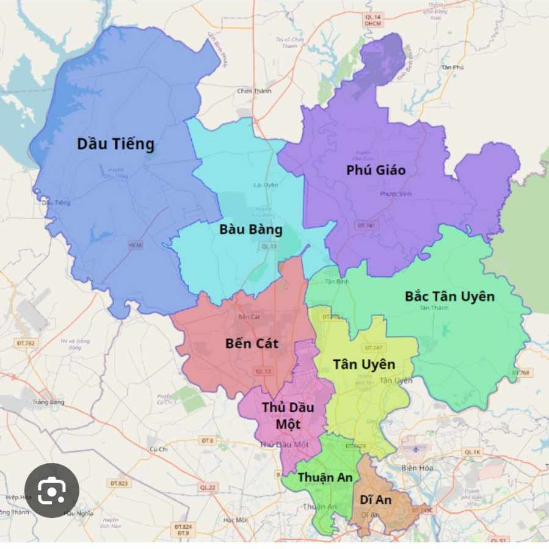

# Hệ thống thông tin địa lý 3 chiều - Bài tập thực hành 1

Vẽ bản đồ hành chính 1 tỉnh/ thành phố/khu vực tùy chọn có ít nhất 8 vùng trên bản đồ khu vực đông nam bộ.

Thể hiện khác quận/ huyện trong tỉnh bằng các vùng và đánh dấu những thành phố, thị xã, trường học bằng những ký hiệu click vào hiện thông tin chi tiết đối tượng.

Khi click vào quận/huyện/TP sẽ hiển thị thông tin diện tích, dân số của nó.

Vẽ 8 tuyến đường quốc lộ/tỉnh lộ qua tỉnh. Khi click vào tuyến đường xem được thông tin chi tiết của nó.

Lưu ý:

Đây là bài tập thực hành theo nhóm.

Đối với icon cho point dùng symbol "picture-marker".

## Bản đồ Bình Dương

